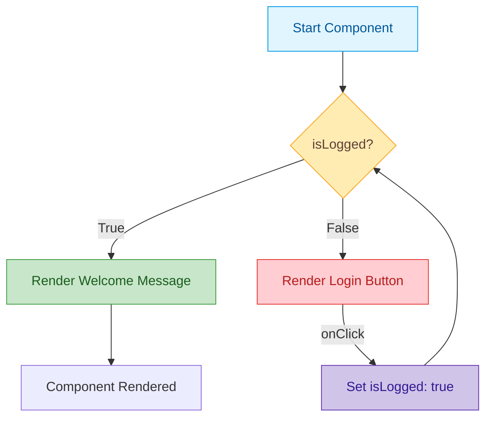
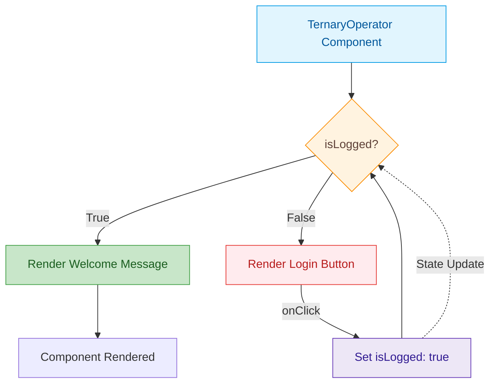

## Using If/Else Statements
- This method works well when the condition is more complex.

## Using Ternary Operator 
- It’s often used when the logic is simple and there are only two options to render.

